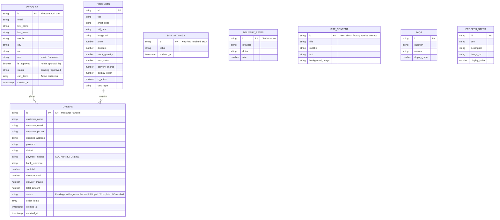

# 🌿 Cinnamon Heritage — Complete Technical Architecture & A-to-Z Project Report

---

## 1. 📌 Executive Overview & Project Identity

* **Project Name:** Cinnamon Heritage (Pvt) Ltd — Web Application & E-Commerce CMS
* **Version:** 2.0.0 (Serverless Firestore Edition)
* **Domain Focus:** Premium Ceylon Cinnamon (*Cinnamomum verum*) Global Export, Retail E-Commerce, B2B Bulk Inquiries, Essential Oils, Farm Tours & Eco-Villa Bookings.
* **Architecture Style:** Client-Side Single Page Application (SPA) & Dynamic Multi-Page Frontend with Serverless Cloud Database (Google Firebase Firestore & Firebase Auth).
* **Target Audience:** International B2B buyers, wholesale importers, domestic retail customers, and eco-tourists.

---

## 2. 🛠️ Technology Stack & Dependencies

### Frontend Core
| Layer | Technology | Version | Purpose |
|---|---|---|---|
| **Markup** | HTML5 Semantic | Standard | Structure & SEO schema markup (`schema.org`) |
| **Styling** | CSS3 & Custom Variables | Custom | Glassmorphism, Dark Luxury Theme, Responsive Breakpoints |
| **CSS Framework** | Bootstrap | 5.3.2 | Grid system, Modals, Forms, Dropdowns, Offcanvas |
| **Icons** | Font Awesome & Bootstrap Icons | 6.0.0 / 1.11.3 | UI icons, status indicators, payment icons |
| **Typography** | Google Fonts | Web | `Oswald` (Luxury Headings), `Inter` (UI & Body), `JetBrains Mono` |

### Backend & Cloud Services
| Service | Provider | Purpose |
|---|---|---|
| **Authentication** | Firebase Auth (Compat v10.8.0) | Customer & Admin Authentication (Email/Password) |
| **Cloud Database** | Cloud Firestore (Compat v10.8.0) | Real-time NoSQL document store for products, orders, settings, content |
| **Analytics & Charts**| Chart.js (v4.x CDN) | Sales Trends, Revenue, Payment Method distribution in Admin Panel |
| **Email Gateway** | EmailJS Browser SDK (v4) | Contact & B2B enquiry automated email notifications |
| **Hosting & Deployment** | Vercel Static Hosting (`vercel.json`) | Global edge CDN delivery |

---

## 3. 🗄️ Database Architecture (Cloud Firestore Collections)



---

## 4. 📄 Application Pages & User Interfaces

### A. Customer Storefront — [`index.html`](file:///E:/wamp/www/Cinnamon%20Heritage/index.html)
1. **Hero Section:** Dynamic headline, call-to-action, estate background image with video preview modal.
2. **Product Catalog & Quick Buy:** Filterable grid with stock check, discounts, and "Add to Cart" / "Buy Now".
3. **Essential Oils & B2B Inquiry Form:** Wholesale inquiries with instant certificate selection and email triggers.
4. **Cinnamon Experience & Villa Tour:** Booking showcases for eco-tourism and artisanal processing.
5. **Interactive Dual-Tab Drawer (Cart & My Orders):**
   * **Cart Tab:** Quantity counters, line-item discounts, subtotal, and checkout entry.
   * **My Orders Tab:** Real-time Amazon/Daraz style order tracking stepper (`Pending` ➔ `In Progress` ➔ `Packed` ➔ `Shipped` ➔ `Completed`), active order glowing pulse dot.
6. **Glassmorphic Auth Modal:** Login & Sign-up with role selection, password show/hide eye toggles, district/province cascading selectors.
7. **Dynamic CMS Footer:** Managed contact info, policy links, developer credentials, and social links.

### B. Single & Cart Checkout — [`checkout.html`](file:///E:/wamp/www/Cinnamon%20Heritage/checkout.html)
1. **Automated Order Mode Detection:** Detects `?cart=true` or single item direct purchase via `?id=...&qty=...`.
2. **Dynamic Payment Gateway Selection:**
   * **Cash on Delivery (COD)** (Admin on/off toggle)
   * **Bank Transfer** (Admin on/off toggle with live dynamic account details & reference upload)
   * **Pay Now (Card / Online)** (Admin on/off toggle)
3. **District-based Dynamic Delivery Rate Calculation:** Instant freight recalculation upon district change.
4. **Atomic Transaction Ordering & Auto-Cart Cleanup:** Atomically decrements stock in Firestore and clears cart upon order completion.

### C. Enterprise Admin Portal — [`admin.html`](file:///E:/wamp/www/Cinnamon%20Heritage/admin.html)
1. **Dashboard Home:**
   * Uniform stat cards: **Earnings (Today)**, **Earnings (Month)**, **Total Orders**, **In Progress Orders**, **Active Products**.
   * Quick Stats: **This Year's Earnings**, **Lifetime Earnings**, Unread Inquiries, Process Step Counts.
   * Top product performance table with auto stock health indicators.
2. **Orders Management System:**
   * Status summary count boxes: Total, Pending, In Progress, Packed, Shipped, Completed, Cancelled.
   * Date / Time / Year / Month / Custom Range filters & instant text search.
   * **Update Process Modal** with 6 status steps (`Pending`, `In Progress`, `Packed`, `Shipped`, `Completed`, `Cancelled`).
3. **Content Management System (CMS):** Hero editor, About Us, Factory, Process Steps, Products manager, Essential Oils, FAQ manager, Delivery Rates editor.
4. **E-Commerce & Payment Settings:** Global toggles for COD, Bank Transfer (with bank credentials), Pay Now, low stock threshold, default delivery charges.
5. **Admin Account Governance:** Strict approval workflow (Pending by default, approval required by super admin).
6. **Analytics & Financial Reports:** Chart.js revenue trend graphs and payment method breakdown.

---

## 5. ⚙️ Detailed Modules & JavaScript Core

### 1. `js/firebase.js` — Cloud Engine & Firestore Layer
* **Authentication:** `authLogin()`, `authSignup()`, `authLogout()`, `authStatus()`, `updateProfileData()`
* **Cart Operations:** `getCartItems(userId)`, `saveCartItems(userId, cartItems)`
* **Atomic Order Placement:** `placeOrder(orderData)` via `db.runTransaction()` to atomically deduct inventory and prevent overselling.
* **Real-Time Listeners:** `subscribeToUserOrders(email, callback)`, `subscribeToContent()`, `subscribeToProducts()`, `subscribeToSettings()`
* **Analytics Engine:** `getDashboardStats()` (calculates today, month, year, and lifetime earnings).
* **Database Seeder:** `seedDatabaseIfNeeded()` auto-populates initial catalogs, delivery rates, and content on first run.

### 2. `js/main.js` — Client Interactivity & UI Controllers
* **Preloader Optimization:** Fast 1s hard limit with `0.3s` transition.
* **Live Order Tracking:** `setupUserOrdersTracking()` renders real-time Amazon-style progress cards inside the cart drawer.
* **Dual Drawer Controller:** Seamless switching between Cart items and Live Orders.
* **Password Toggle Eye Icons:** Event handlers on password and confirmation fields.
* **Cart Sync:** Dual syncing between `localStorage` (guest) and Firestore (authenticated user).

### 3. `js/admin.js` — Administration & Analytics Engine
* **Order Filter Engine:** `onOrderFilterChange()`, `filterBySummaryStatus()`, `resetOrderFilters()`.
* **Process Update Action:** `viewOrder()`, `updateOrderStatusAndRefresh()`.
* **Dashboard Analytics:** Live metrics calculation, Chart.js rendering, stock alerts.
* **Admin Account Verification:** Auto-deduplication and approval state enforcement.

---

## 6. 🔄 Key Business Workflows

### A. Real-Time Order & Tracking Flow
```
Customer places order (checkout.html)
    │
    ├──> db.runTransaction() validates & reduces stock
    ├──> Cart automatically cleared in Firestore / LocalStorage
    ├──> User redirected to index.html?order_placed=ID
    │
    └──> Cart Drawer opens "My Orders" tab
            │
            └──> subscribeToUserOrders() listens in real time
                    │
                    ▼
          [Pending] ➔ [In Progress] ➔ [Packed] ➔ [Shipped] ➔ [Completed]
                    ▲
                    │ (Admin updates status in admin.html)
```

### B. Admin Account Security Workflow
```
New Admin Registers (admin.html or index.html)
    │
    ├──> is_approved: false, status: 'pending' set in Firestore
    ├──> User immediately logged out
    │
    ▼
Existing Super Admin opens "Admin Accounts" in Admin Panel
    │
    └──> Clicks "Approve" ➔ is_approved: true, status: 'approved'
            │
            ▼
New Admin can now log in successfully.
```

---

## 7. 🚀 Security, Performance, & Production Readiness

1. **Transaction Safety:** All order placements are ACID-compliant Firestore transactions.
2. **Session Caching:** Real-time data caching in `sessionStorage` with instant background revalidation.
3. **Fast Loading:** Preloader guaranteed under 1s with skeleton loading.
4. **Responsive Luxury Design:** Optimized for 4K desktop, laptop, tablet, and mobile screens.
